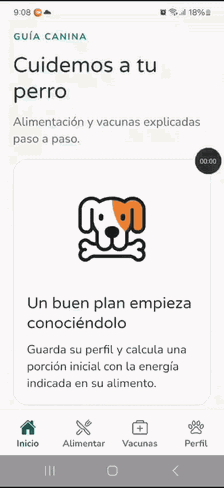

# Guía Canina

A mobile app to support dog care in Nicaragua. It provides an **initial feeding estimate**, stores measurements, and offers a **general vaccination guide**. Built with Expo and React Native, the app's interface is in Spanish.



## Current features

- **Feeding:** estimates daily energy needs from a dog's weight and life stage. When the food's energy density is provided, it calculates grams per day and per meal, accounting for treats and other calories. If the inputs call for individual assessment, it recommends veterinary advice instead of showing a routine portion.
- **Profile and tracking:** stores the dog's profile, feeding plans, and recent weight and body condition measurements in a local SQLite database on the device (`dog-care.db`). The app also has an option to erase all saved data.
- **Vaccines:** provides an educational guide for puppies and adults, information about the diseases, and guidance following bites or possible rabies exposure. References are available in the app.

The vaccine section **does not yet record administered doses or create reminders, alarms, or calendar events**. These features are planned for a later phase in the [implementation plan](DOG_CARE_IMPLEMENTATION_PLAN.md).

## Run locally

You need Node.js, npm, and [Expo Go](https://expo.dev/go) on your phone.

```bash
git clone https://github.com/bramoreirac/app_expo.git
cd app_expo
npm ci
npx expo start
```

Scan the QR code with Expo Go. If the local network connection does not work, start Expo with a tunnel:

```bash
npx expo start --tunnel
```

In PowerShell, if the execution policy blocks Node's `.ps1` scripts, use `npm.cmd` and `npx.cmd` in the commands above (for example, `npm.cmd ci` and `npx.cmd expo start --tunnel`). See the [Expo Go connection troubleshooting guide](troubleshooting/EXPO_GO_CONNECTION_TROUBLESHOOTING.md) for details.

## Build a test APK

View the [Android preview build on Expo](https://expo.dev/accounts/bramoreira/projects/MiPrimeraApp/builds/d5512c20-cec6-4a04-ad49-0d8524ada3df). Scan the QR code with your phone's camera to open that same build page and follow its installation instructions. This QR code is for the build page, not for the Expo Go development server.


With an Expo account, run this [EAS CLI](https://docs.expo.dev/build/introduction/) command from the project root:

```powershell
npx.cmd eas-cli@latest build -p android --profile preview
```

The `preview` profile in [`eas.json`](eas.json) uses internal distribution, allowing the resulting APK to be installed directly on Android. For a previous build failure and its fix, see the [EAS troubleshooting report](troubleshooting/EAS_ANDROID_BUILD_TROUBLESHOOTING.md).

## Checks

```bash
npm test
npm run lint
```

## Scope of the guidance

Feeding calculations are starting estimates and require follow-up of weight and body condition. The vaccine guide provides general information: **it does not determine a dog's vaccination status or replace a veterinarian's assessment**. Data is stored on the device; the app does not provide cloud synchronization.

The project's requirements and references are in the [feeding and vaccination specification](dog_feeding_vaccination_spec_nicaragua.md). Planned work is described in the [implementation plan](DOG_CARE_IMPLEMENTATION_PLAN.md).
